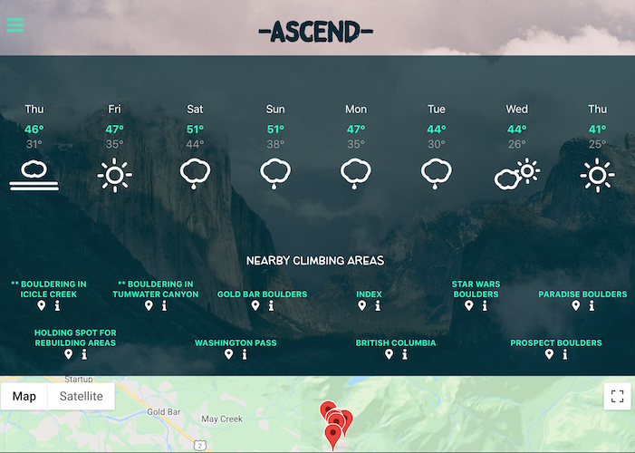
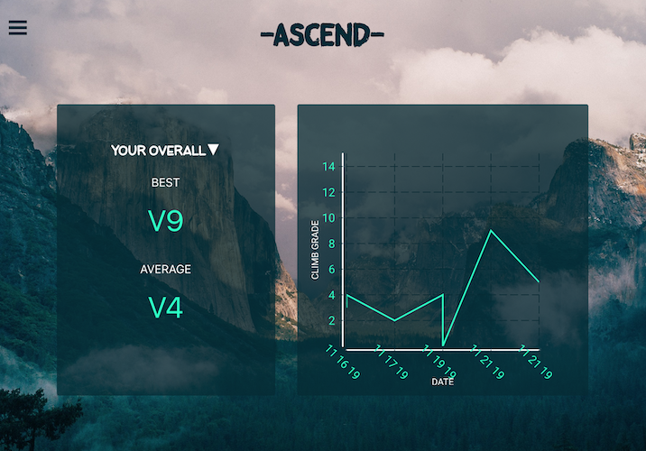
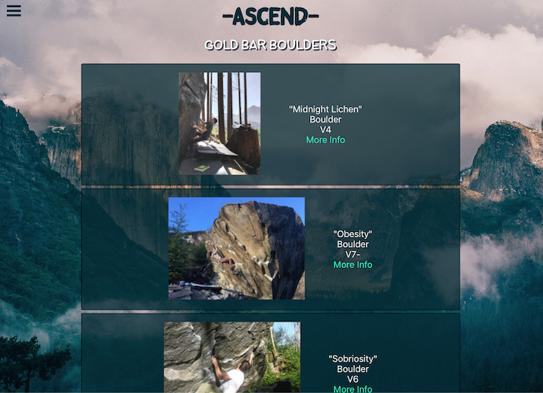

# Ascend

## Live App: https://ascend.now.sh/
### Try it out:
login: testuser@email.com

password: Password1

## Summary
Ascend is a one-stop app for rock climbers who want to venture outside. Using your browser location, see nearby climbing areas, routes, and weather. Clicking a route's map marker will give you the option to add the route to your tracked climbs - where (once you've created an account and logged in) you can save all of the details for the route as well as your status (whether you successfully completed the climb or just attempted it). After saving completed climbs to your list, you can check out the "Stats" component to see your average and best grades climbed, as well as a graph visual showing your improvement.

## Tech Used
* Front-End: React, HTML5, CSS3
* Back-End: Node.js, Express, PostgreSQL

## Credit
* Weather is from 
* Nearby climb data is from 
* Maps are from 

## Build Status - Features In Development
* Support for other locations: users will be able to enter a city name rather than just seeing nearby climbs
* Sorted statistics: along with the current "overall" view, users will be able to see their stats by day/week/month/year.
* Authentication: upcoming support for JWT refresh, as well as password change

## API Docs
* Express Server provides methods for account creation and login with JWT, as well as for getting all of a user's saved climbs, adding climbs to a user's list, and deleting climbs belonging to a user.

## Screenshots
Plan Page:

Stats Page:

Location Details Page:

